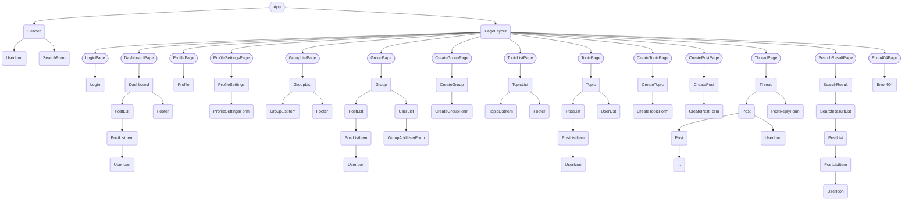

# Experis Connect (experis-connect-frontend)

After creating an account, users can login and maintain their personal profile. They can create and join groups and topics, and publish posts in these groups and topics.

## Table of Contents

- [Background](#Background)
- [Install](#Install)
- [Usage](#Usage)
- [Component tree](#component-tree)
- [Maintainers](#Maintainers)
- [Contributing](#Contributing)
- [License](#License)

## Background

The aim of this project was to create an Alumni Networking Portal to maintain contact between current and previous candidates in the Noroff Accelerate program.

### Technologies

This app is built with [React](https://react.dev/), [TypeScript](https://www.typescriptlang.org/) and [Vite](https://vitejs.dev/). It uses [Redux](https://redux.js.org/) for global state management, [React Router](https://reactrouter.com/), [TanStack Query](https://tanstack.com/query/latest) and other libraries for extended functionality.

Authentication is handled by a [Key Cloak](https://www.keycloak.org) server and implemented using the [JavaScript adapter](https://www.keycloak.org/docs/latest/securing_apps/#_javascript_adapter) to follow the [OpenID Connect](https://openid.net/connect/)/[OAuth 2.0](https://oauth.net/2/) standard.

Code standard is maintained by using [ESLint](https://eslint.org/) and [Prettier](https://prettier.io/).

## Install

Use `git clone` to clone the repository. Run `npm install` to install dependencies.

## Usage

### Environment variables

Create a `.env` file following the `.env.template` file to supply the required environment variables.

### Development server

Run `npm run dev` for a dev server. Navigate to `http://localhost:5173/`. The application will automatically reload if you change any of the source files.

## Component tree

## Maintainers

- [@Luisa Möhle](https://github.com/ansmeer)
- [@Odd Martin Kveseth](https://github.com/OddM91)
- [@Eivind Skandsen](https://github.com/Ddayisme)
- [@William Vilhelmsen](https://www.github.com/William-vil)
- [Eir Aulie]()

## Contributing

This project is currently not open for contributions, but you are welcome to work on your own copy of it.

## License

MIT © 2023 Luisa Möhle, Odd Martin Kveseth, William Vilhelmsen, Eivind Skandsen & Eir Aulie
